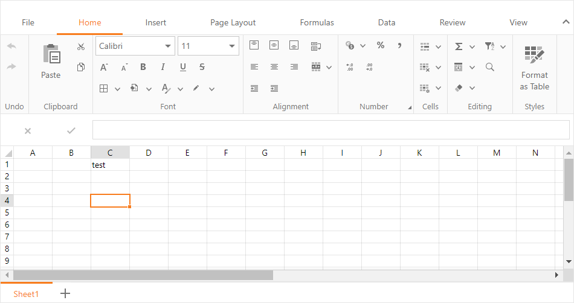

<!-- default badges list -->

[](https://supportcenter.devexpress.com/ticket/details/T190813)
[](https://docs.devexpress.com/GeneralInformation/403183)
[](#does-this-example-address-your-development-requirementsobjectives)
<!-- default badges end -->
# Spreadsheet for ASP.NET MVC - How to save/load documents to/from a database

This example demonstrates how to configure the [Spreadsheet extension](https://docs.devexpress.com/AspNetMvc/17113/components/spreadsheet) to save/load documents to/from a database.



## Overview

Follow the steps below to configure the Spreadsheet extension to work with a database:

1. Create a class that models a spreadsheet document. This class should be able to store document identifiers, file formats, and content:

    ```cs
    public class SpreadsheetData {
        public string DocumentId { get; set; }
        public DocumentFormat DocumentFormat { get; set; }
        public byte[] Document { get; set; }
    }
    ```

2. Register the database context:

    ```cs
    public partial class DocumentsEntities : DbContext {
        public DocumentsEntities(): base("name=DocumentsEntities") {}
        protected override void OnModelCreating(DbModelBuilder modelBuilder) {
            throw new UnintentionalCodeFirstException();
        }
        public virtual DbSet<Doc> Docs { get; set; }
    }

    public partial class Doc {
        public int Id { get; set; }
        public byte[] DocBytes { get; set; }
        public string Comments { get; set; }
    }
    ```

3. Add connection strings to the **Web.config** file:

    ```xml
    <connectionStrings>
        <add name="DocumentsConnectionString" connectionString="Data Source=(local);Initial Catalog = Documents;User Id=sa; Password=dx;Connect Timeout=30" providerName="System.Data.SqlClient" />
        <add name="DocumentsEntities" connectionString="metadata=res://*/Models.Model1.csdl|res://*/Models.Model1.ssdl|res://*/Models.Model1.msl;provider=System.Data.SqlClient;provider connection string=&quot;Data Source=(localdb)\MSSQLLocalDB;AttachDbFilename=|DataDirectory|Documents.mdf;Integrated Security=True;connect timeout=30;MultipleActiveResultSets=True;App=EntityFramework&quot;" providerName="System.Data.EntityClient" />
    </connectionStrings>
    ```

4. Create a helper class that works with the database. The class should be able to load a document from a database as an array of bytes and save the byte array back to the database:

    ```cs
    public class DataHelper {
        public static byte[] GetDocument() {
            DocumentsEntities context = new DocumentsEntities();
            return context.Docs.FirstOrDefault().DocBytes.ToArray();
        }

        public static void SaveDocument(byte[] bytes) {
            DocumentsEntities context = new DocumentsEntities();
            context.Docs.FirstOrDefault().DocBytes = bytes;
            context.SaveChanges();
        }
    }
    ```

5. Create the `SpreadsheetSettingsHelper` helper class that configures and returns the [SpreadsheetSettings](https://docs.devexpress.com/AspNetMvc/DevExpress.Web.Mvc.SpreadsheetSettings?p=netframework) object. Specify the object's [Name](https://docs.devexpress.com/AspNetMvc/DevExpress.Web.Mvc.SettingsBase.Name) and [CallbackRouteValues](https://docs.devexpress.com/AspNetMvc/DevExpress.Web.Mvc.SpreadsheetSettings.CallbackRouteValues) properties. Set the [Saving](https://docs.devexpress.com/AspNetMvc/DevExpress.Web.Mvc.SpreadsheetSettings.Saving?p=netframework) property to a function that converts an opened document to a byte array and saves it to the database:

    ```cs
    public static class SpreadsheetSettingsHelper {
        public static SpreadsheetSettings GetSpreadsheetSettings() {
            SpreadsheetSettings settings = new SpreadsheetSettings();
            settings.Name = "SpreadsheetName";
            settings.CallbackRouteValues = new { Controller = "Home", Action = "SpreadsheetPartial" };
            settings.Saving = (s, e) => {
                byte[] docBytes = SpreadsheetExtension.SaveCopy("SpreadsheetName", DocumentFormat.Xlsx);
                DataHelper.SaveDocument(docBytes);
                e.Handled = true;
            };
            // ...
            return settings;
        }
    }
    ```
    
6. In a partial view, pass the settings that the `SpreadsheetSettingsHelper` class configures to the [Spreadsheet](https://docs.devexpress.com/AspNetMvc/DevExpress.Web.Mvc.UI.ExtensionsFactory.Spreadsheet(DevExpress.Web.Mvc.SpreadsheetSettings)?p=netframework) extension method to create the Spreadsheet. Call the Spreadsheet's [Open](https://docs.devexpress.com/AspNetMvc/DevExpress.Web.Mvc.SpreadsheetExtension.Open(System.String-DevExpress.Spreadsheet.DocumentFormat-System.Func-System.Byte---)?p=netframework) method to open the document stored in the model:

    ```razor
    @model DXWebApplication23.Models.SpreadsheetData

    @Html.DevExpress().Spreadsheet(SpreadsheetSettingsHelper.GetSpreadsheetSettings()).Open(
        Model.DocumentId, 
        Model.DocumentFormat, 
        () => { return Model.Document; }
    ).GetHtml()
    ```

7. Configure the controller. In the `Index` action method, load a document from the database and save it to a model. In the action method you assigned to the `CallbackRouteValues` setting, use the `SpreadsheetSettingsHelper` class to configure Spreadsheet settings, then return them back to the client: 

    ```cs
    public class HomeController : Controller {
        [HttpGet]
        public ActionResult Index() {
            var model = new SpreadsheetData() {
                DocumentId = Guid.NewGuid().ToString(),
                DocumentFormat = DocumentFormat.Xlsx,
                Document = DataHelper.GetDocument()
            };
            return View(model);
        }

        // The method assigned to the Spreadsheet's CallbackRouteAction property in the helper class
        public ActionResult SpreadsheetPartial() { 
            return SpreadsheetExtension.GetCallbackResult(SpreadsheetSettingsHelper.GetSpreadsheetSettings());
        }
    }
    ```

## Files to Review

* [SpreadsheetPartial.cshtml](./CS/DXWebApplication23/Views/Home/SpreadsheetPartial.cshtml)
* [HomeController.cs](./CS/DXWebApplication23/Controllers/HomeController.cs) (VB: [HomeController.vb](./VB/DXWebApplication23/Controllers/HomeController.vb))
* [DataHelper.cs](./CS/DXWebApplication23/Models/DataHelper.cs) (VB: [DataHelper.vb](./VB/DXWebApplication23/Models/DataHelper.vb))
* [Index.cshtml](./CS/DXWebApplication23/Views/Home/Index.cshtml)

## Documentation

* [Creating a Connection String and Working with SQL Server LocalDB](https://learn.microsoft.com/en-us/aspnet/mvc/overview/getting-started/introduction/creating-a-connection-string)
* [Office Document Management](https://docs.devexpress.com/AspNetMvc/402337/common-features/office-document-management)

## More Examples

* [Spreadsheet for ASP.NET Web Forms - How to save/load documents to/from a database](https://github.com/DevExpress-Examples/aspxspreadsheet-how-to-save-and-load-documents-from-a-database-t190812)
<!-- feedback -->
## Does this example address your development requirements/objectives?

[](https://www.devexpress.com/support/examples/survey.xml?utm_source=github&utm_campaign=asp-net-mvc-spreadsheet-work-with-database&~~~was_helpful=yes) [](https://www.devexpress.com/support/examples/survey.xml?utm_source=github&utm_campaign=asp-net-mvc-spreadsheet-work-with-database&~~~was_helpful=no)

(you will be redirected to DevExpress.com to submit your response)
<!-- feedback end -->
